# Advanced OpenLANE Workshop

## Workshop Introduction
This was a 5-day workshop which was extensively conducted using opensource EDA tools(Openlane) by VSDOpen .

### Workshop Timeline

## DAY-1

### TASK
To learn about skywater PDK and implement synthesis stage in openlane.

### LAB

**Design directory**

  Design directory stores all the design files\
  The input files which u want to pass into openlane has to be stored in thos directory\

 
 
 

**Openlane flow entry**

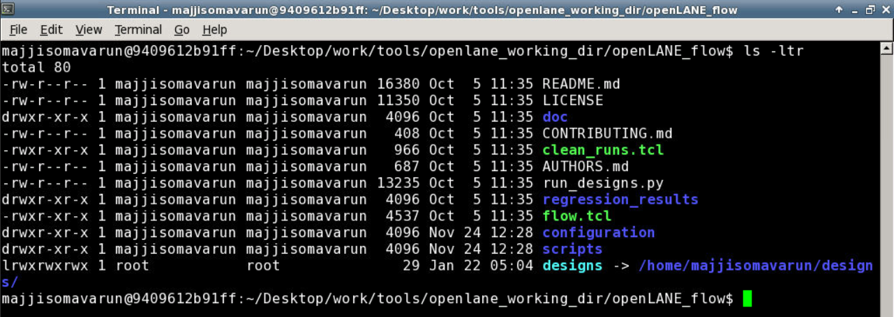

1.Go to openlane flow directory\
 Desktop/work/tools/openlane_working_directory/openlane_flow\
2.Type\
./flow.tcl -interactive\
3.Now you will enter to open lane flow and type\
package require openlane 0.9

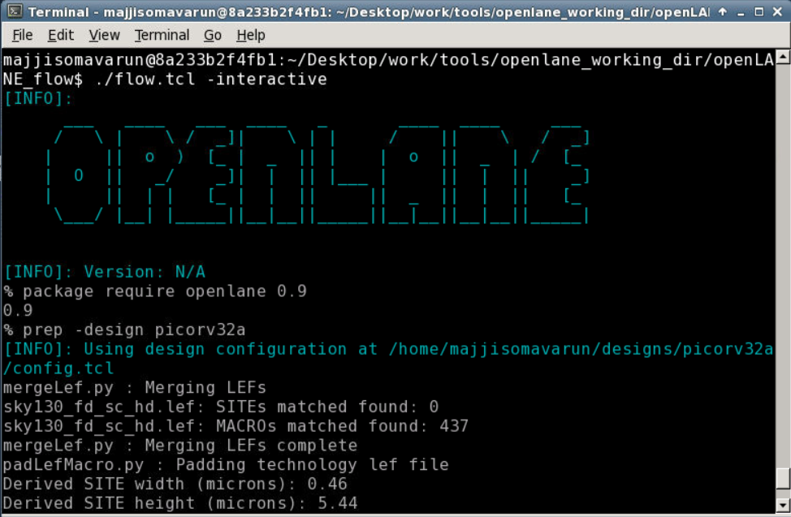

4.Pass your design into openflow\
prep -design picorv32a \
-design ->pass the design folder name where you stored your input files to openlane

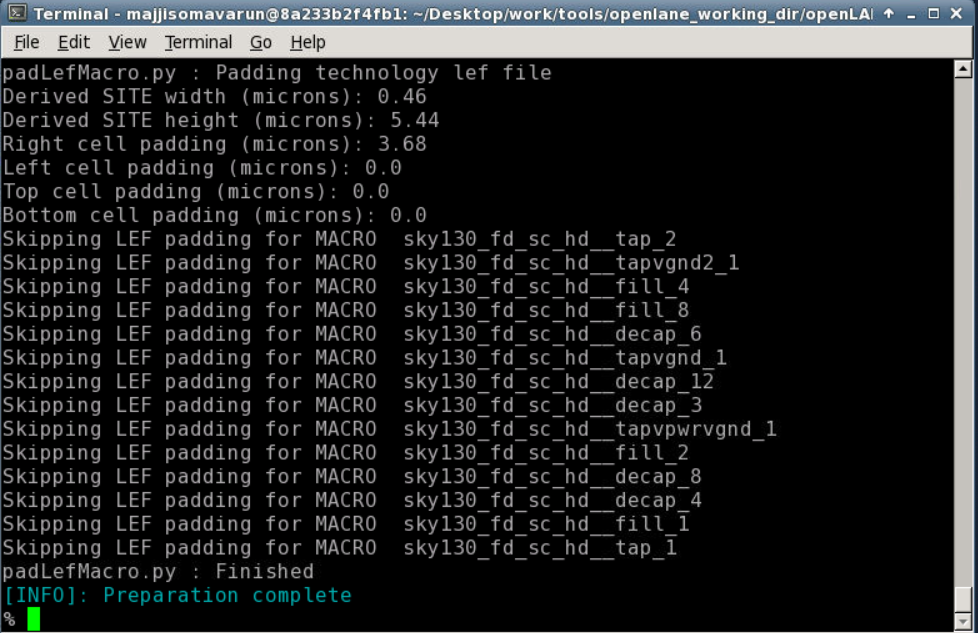
Now openlane basically merges the lef file and technology file and forms a merged file called merged.lef\

5.We are passing picorv32a design into openlane.We can find picorv32a folder in design directory.\
There the verilog input files are stored in src folder.\
Config.tcl is used to set all variables with desired values for openlane flow.\
Runs directory stores all the  run instances.By default run instance name is particular time and date of run.

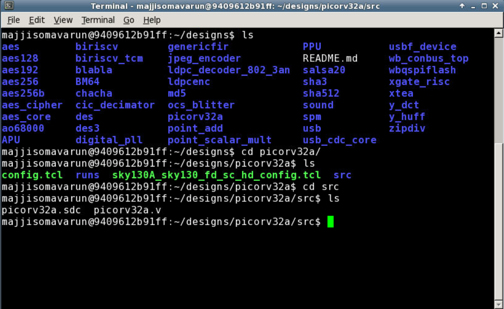

Config.tcl has parameters like clock_period,target_density which can be set to desired values

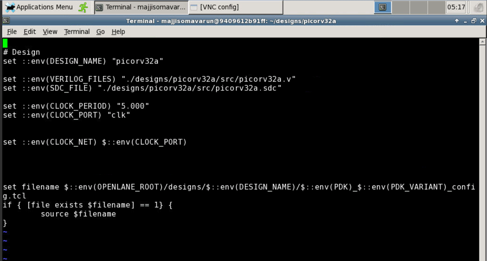

6.Type \
run_synthesis \
you will be able to see netlist formed by yosis and abc maps that netlist to skywater pdk cells.\
A yosis reprt will be generated which contains all information of cells used in syntheis file .

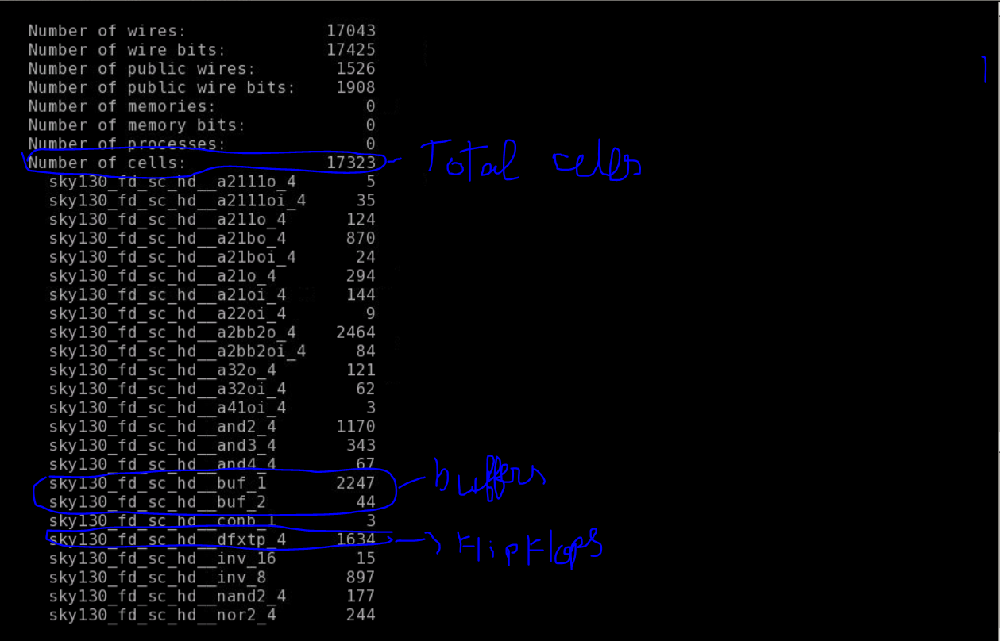

Flipflop ratio=total no of dtxflops/total no of cells = (1634/17323) = 0.094\
Buffer ratio=total no of buufers/total no of cells = ((2247+44)/17323) = 0.132

STA report generated by OpenSta software at end of synthesis

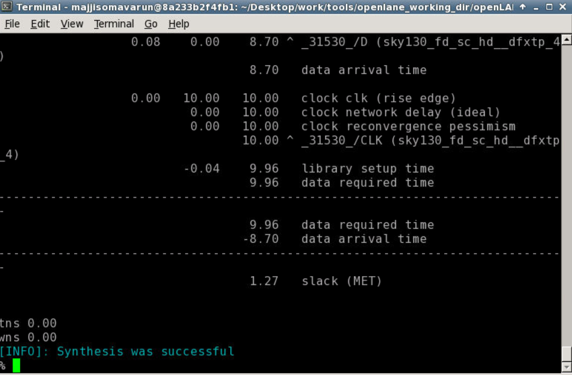

The new synthesis file will be stored in <designs/picorv32a/runs/"run_file_name"/results/synthesis>

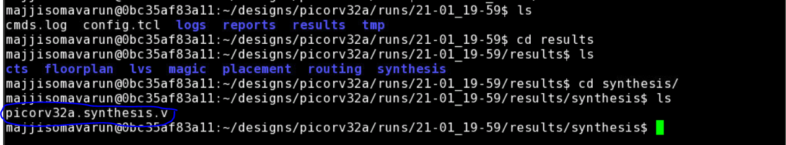

Inside the run instance we find one more config.tcl.This file contains all variables which were set by the user.
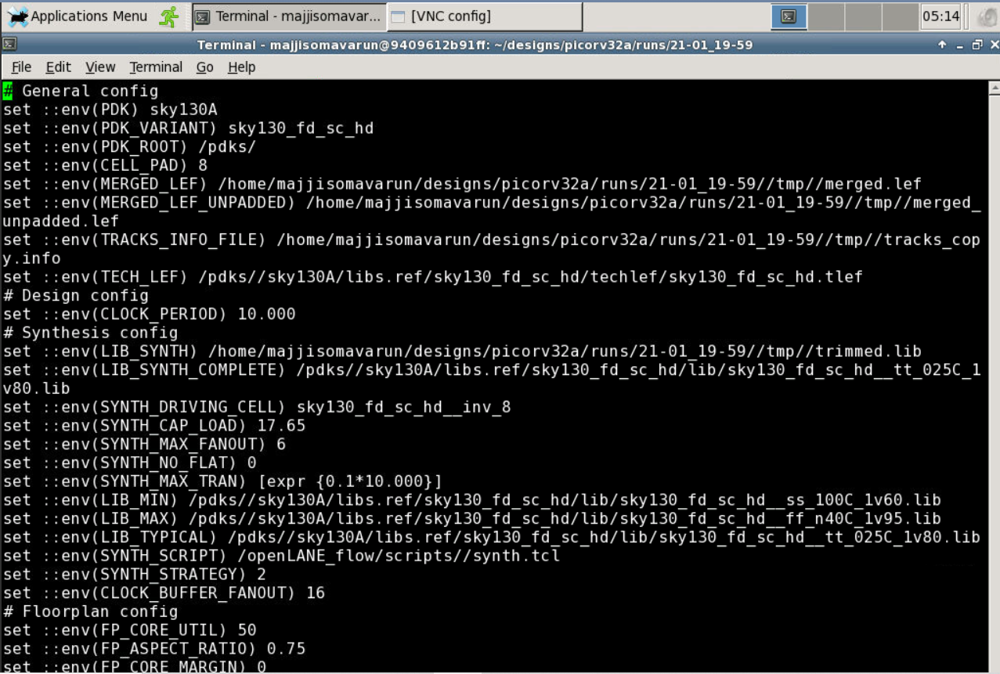

In reports directory of the your run instance you can find synthesis directory.Here all reports generated during synthesis stage are stored.

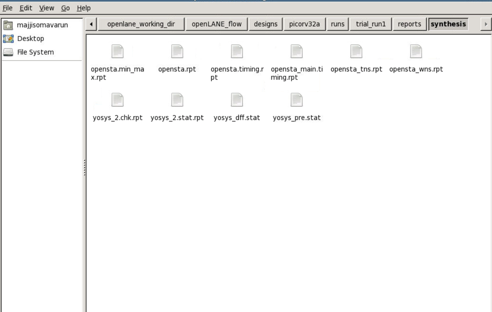 

**PDKs**
In PDK folder of oepnlane_working_directory you will find three folders. \
Skywater PDK-This is PDK which contaions all standard cells,spice files,library files etc\
Open PDK-This basically consists of scripts which sorts the files in skywater PDK according to particular open source EDA tool.\
SKY130 - Open PDK script creates specific folders for each open source eda tool and places those files from skywater PDK after sorting.\
.
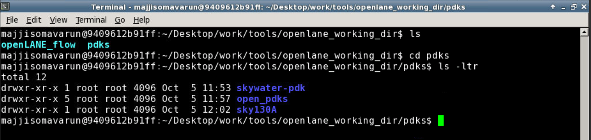

## Day-2

### TASK
To implement Floorplan in Openlane and understand the steps to lay good floorplan

**Steps involved in Floorplanning**

1.Define width and height of core and die\
2.Define locations of preplaced cells\
3.Surround Preplaced cells with decoupling capacitors\
4.Power Planning\
5.Pin Placement

**Netlist**-Defines the connectivity of gates\
**Utilization Faztor**=Area occupied by netlist/Area of the core\
**Aspect Ratio**=height/width\

### NOTES
The routing wires consists of parasetic resistance which leads to voltage drop and we could not reach rail to rail voltage at output.**Decoupling capacitors** are used to replenish the charge in a preplaced cell during transition so that we reach rail volatage of VDD.\
Frontend team decides **netlist connectivity** and backened team decides **pin placement**.\
Mostly clock paths are of bigger width comparatevely as they drive most of the cells on core like flipflops ,so it ensures least resistance path.\
Standard Cell palcement happens in placement stage not in floorplan\
Buffers are used in between tracks to replenish the strength of the signal **(signal integrity)**.\
The supply grids are always on the top metal layers as it provides least resistance path. Hence it ensures no losses. You can connect lower metal  layers and top metal layers using vias.

### LAB

1.Go into openlane_flow and follow steps of day.Now we can name our run instance with a user defined name.Here i name it trial_run1 using keyword -tag.

[]!(day_2/prep.PNG)

