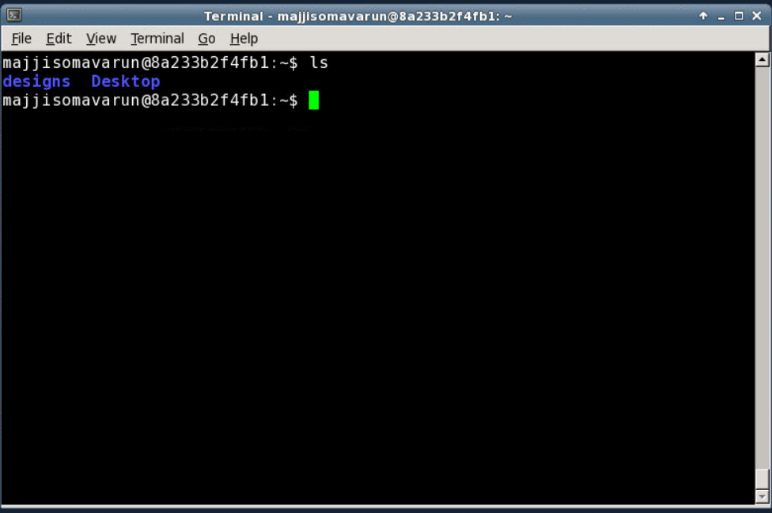

# advanced_openlane_workshop-documentation
Its a workshop conducted by VSD team
### DAY-1

Opening the terminal

### DAY-2(Floor plan)

**Steps involved in Floorplanning**
1.Define width and height of core and die\
2.Define locations of preplaced cells\
3.Surround Preplaced cells with decoupling capacitors\
4.Power Planning\
5.Pin Placement\

**Notes**
Netlist-Defines the connectivity of gates\
Utilization Faztor=Area occupied by netlist/Area of the core\
Aspect Ratio=height/width\
The arrangement of IPs in a chip is called floor planning\
The routing wires consists of parasetic resistance which leads to voltage drop and we could not reach rail to rail voltage at output.Decoupling capacitors are used to replenish the charge in a preplaced cell during transition so that we reach rail volatage of VDD.\
Frontend team decides netlist connectivity and backened team decides pin placement.\
Mostly clock paths are of bigger width comparatevely as they drive most of the cells on core like flipflops ,so it ensures least resistance path.

