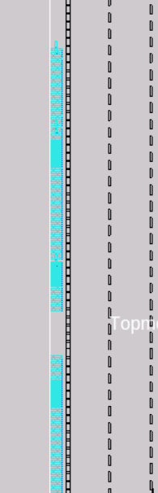

# Advanced OpenLANE Workshop

## Workshop Introduction
This was a 5-day workshop which was extensively conducted using opensource EDA tools(Openlane) by VSDOpen .

### Workshop Timeline

## DAY-1

### TASK
To learn about skywater PDK and implement synthesis stage in openlane.

### LAB

**Design directory**

  Design directory stores all the design files\
  The input files which u want to pass into openlane has to be stored in thos directory\

 
 
 

**Openlane flow entry**

Go to openlane flow directory\
 Desktop/work/tools/openlane_working_directory/openlane_flow\
Type `./flow.tcl -interactive`\
Now you will enter to open lane flow and type `package require openlane 0.9`

Pass your design into openflow\
`prep -design picorv32a` \
-design ->pass the design folder name where you stored your input files to openlane

Now openlane basically merges the lef file and technology file and forms a merged file called merged.lef\

We are passing picorv32a design into openlane.We can find picorv32a folder in design directory.\
There the verilog input files are stored in src folder.\
Config.tcl is used to set all variables with desired values for openlane flow.\
Runs directory stores all the  run instances.By default run instance name is particular time and date of run.

Config.tcl has parameters like clock_period,target_density which can be set to desired values

Type `run_synthesis` \
you will be able to see netlist formed by yosis and abc maps that netlist to skywater pdk cells.\
A yosis reprt will be generated which contains all information of cells used in syntheis file .

`Flipflop ratio=total no of dtxflops/total no of cells = (1634/17323) = 0.094`\
`Buffer ratio=total no of buufers/total no of cells = ((2247+44)/17323) = 0.132`

STA report generated by OpenSta software at end of synthesis

The new synthesis file will be stored in `<designs/picorv32a/runs/"run_file_name"/results/synthesis>`

Inside the run instance we find one more config.tcl.This file contains all variables which were set by the user.

In reports directory of the your run instance you can find synthesis directory.Here all reports generated during synthesis stage are stored.

 

**PDKs** 

In PDK folder of openlane_working_directory you will find three folders. \
**Skywater PDK**-This is PDK which contaions all standard cells,spice files,library files etc\
**Open PDK**-This basically consists of scripts which sorts the files in skywater PDK according to particular open source EDA tool.\
**SKY130** - Open PDK script creates specific folders for each open source eda tool and places those files from skywater PDK after sorting.\
.

## Day-2

### TASK
To implement Floorplan in Openlane and understand the steps to lay good floorplan

**Steps involved in Floorplanning**

1.Define width and height of core and die\
2.Define locations of preplaced cells\
3.Surround Preplaced cells with decoupling capacitors\
4.Power Planning\
5.Pin Placement

**Netlist**-Defines the connectivity of gates\
**Utilization Faztor**=Area occupied by netlist/Area of the core\
**Aspect Ratio**=height/width\

### NOTES
The routing wires consists of parasetic resistance which leads to voltage drop and we could not reach rail to rail voltage at output.**Decoupling capacitors** are used to replenish the charge in a preplaced cell during transition so that we reach rail volatage of VDD.\
Frontend team decides **netlist connectivity** and backened team decides **pin placement**.\
Mostly clock paths are of bigger width comparatevely as they drive most of the cells on core like flipflops ,so it ensures least resistance path.\
Standard Cell palcement happens in placement stage not in floorplan\
Buffers are used in between tracks to replenish the strength of the signal **(signal integrity)**.\
The supply grids are always on the top metal layers as it provides least resistance path. Hence it ensures no losses. You can connect lower metal  layers and top metal layers using vias.

### LAB

1.Go into openlane_flow and follow steps of day.Now we can name our run instance with a user defined name.Here i name it trial_run1 using keyword -tag.

LEFs and technology layer is merged to form merged layer.

To open existing run instance.

`-overwrite` keyword can be used to empty a previously created run instance.

`echo` command can be used to know the values to which openlane variables are set.

Core_utilization set to 0.65 in config.tcl
!

`run_floorpla`n command used to start floorplan

floorplan complete

Floorplan def file is stored under floorplan directory in results

Inside floorplan def file

those cooardinates are of the form below\
(lbx lby rtx rty)\
lbx-> bottom left x coordinate\
lby-> bottom left y coordinate\
rtx-> top right x cooardinate\
rty-> top left y coordinate

To view floorplan def file we need technolgy file sky130A and merged.lef file\
sky130A is found in `<\openlane_working_dir\pdks\sky130A\libs.tech\magic>`\
merged.lef is found in `<\designs\picorv32a\runs\trail_run1\temp\>`

copy both technology and lef file into directory where floorplan is found `< \designs\picorv32a\runs\trail_run1\results\floorplan>`

Then go to floorplan directory in results  through terminal\
Type
`magic -T sky130A lef read merged.lef def read picorv32a.floorplan.def`\
you will get magic layout

Config.tcl file is modified to set below parameters of floorplan \
FP_IO_VMETAL->4 (metal4)\
FP_IO_HMETAL->3 (metal3)\
FP_IO_MODE-> 1 (Pins are equidistant)

Here you can see pins are equidistant

if `FP_IO_MODE = 2` (pins accumulate in one corner)

Decoupling capacitors placed in floorplan 

Tapcells

We can find all standard cells obtained after synthesis are accumulated in one corner of main core.

Now to start placement type command\
`run_placement`

While placement going on we come across two words:-HPWL and OVFL\
HPWL-Half perimeter wire length is just a model to approximate the wire lengths inorder to use it as parameter to optimise placement\
OVFL-This is overflow parameter which should decrease as placement optimization takes place\

Final placement pass 

Placement def file is stored in following `<\designs\picorv32a\runs\trail_run1\results\placement>`\
Copy SKY130A tech file and merged.lef to that folder where u find placement def\
Through terminal go to the directory of placement def file\
Type \
`magic -T sky130A lef read merged.lef def read picorv32.placement.def`\

Placement

Placement at 0.8 target density (which i set using COMMAND `<set ::env(PL_TARGET_DENSITY) 0.8`>

Placement at 0.4 target density (which i set using COMMAND `<set ::env(PL_TARGET_DENSITY) 0.4`>

## DAY-3

### TASK
To examine custom inverter cell layout of sky130 node in magic.To extract spice file and finally simulate in ngspice to find cell delay and transition times.

### NOTES

### LAB

Clone the repository shown below in figure

In the repository downloaded we find a sky130_vsdinv.mag file.Open it in magic using sky130.tech technology file.\
`magic -tech sky130.tech sky130_vsdinv.mag`

1->Nwell\
2->Metal-1(VDD)\
3->Locali\
4->locali and nsubstrate contact\
5->Metal-1 and locali contact\
6->Polysilicon\
7->Pdiffusion\
8->Metal-1(GND)\
9->Ndiffusion\
10->locali and Ndiffusion contact\
11->locali and Pdiffusion contact\
12->polysilicon and locali contact

To extract spice file from the layout\
Type below commands as shown in figure in TCL/TK window of magic\
`extraxt all`-This commands extraxts the netlist in a different format as compared to spice netlist\
`exttospice`-In order to make extracted netlist compatible with spice we us this command\
`cthresh = 0` - Selects option to include all lumped capacitance greater than zero farad in netlist

Files in vsd folder after extraction from magic.

open the sky130_inv_parasetics.spice file in leafpad

Here pshort.lib and nshort.lib are model files for mosfets of sky130 node.\
.trans command is inserted to indicate transient response\
VPWR ->DC source\
A-> pulse

if Cthresh=0 option not selected then u can see the extracted netlist will not have lumped capacitance included.

As part of exercise we needed to find cell fall delay and fall transition.

Cell fall delay-difference in time instances at which input reaches 50% of vdd from 0 and output reaches 50% of  vdd from vdd.\
Open the simulation file in ngspice
`ngspice sky130_inv_parasetics.spice`

Cell fall delay=2.18ns - 2.15ns = 0.03ns

Fall transition=difference in time instances during falling of output from 80% of vdd to 20%vdd

Fall transition 20% of vdd=0.65V

Fall trsnsition 80% of vdd=2.6V

Fall Transition=2.20ns - 2.16ns =0.04ns

## DAY-4

### TASK-4

To explore inverter layout in magic.Define the ports in magic and export lef file.Insert the custom lef file in our picorv32 design.Do static timing analysis and try to reduce resulting negative slack to zero by buffering and increasing the size of cells.Constructing clock tree using triton cts tool of openroad and do final sta analysis on modified synthesis file after clock tree synthesis.

### Notes

Input and output port should lie on the intersection of vertical and horizotal tracks\
The width of standard cell should be in odd multiples of horizontal track pitch\
The height of standard cell should be in odd multiples of verticle pitch\
Ensurung the port at horizonral and vertical track ensure that route can reach port\
cts done for max and min but should be done for typical as cts is typical\
we always want skew values to 10percent of timeperiod of clk\
inorder to meet skew one of the buffers are chosen ,starting from small size buffer\

### LAB

Pitches and origin of various metals in sky130 which can be found in track info file

To draw grid of origin and pitch of locali metal layer inorder to find whether the coustom inverter cell layout follows standard cell rules to be accuraletly placed by placement tool

Here you can find the grid is intersecting with the ports perfectly which is indicating that standard cell ports are lie on intersection of vertical and horizontal tracks

Do Edit >> Text which opens up a dialogue box.Here you can define ports.

Then go tcl/tk window of magic ,after selecting any port with the layer it is attached type what.There you can see everything like to what metal is connected and in what layer that port is present.Now the task is to define the class of the signal like inout,input or output and define function of the port like signal,ground or power.

Then extract lef file by `lef write` command

LEF file

Now go to files in vsdstdcelldesign folder ,here u can find lef file

In `vsdstdcelldesign/libs` you can find three lib files.These lib files contains all information like power,delays and ports of all standard cells in particular format for three PVT corners(fast,slow and typical).

The view of fast lib file.Here the properties of our custum cell sky130_vsdinv can be found.Tools like yosis and opensta map our custom cell through this lib file only.

Lookup tables are used inorder to characterize different properties like output delays,power,transition etc for different combinations of input slew and output capacitance.In below figure you can see characterization of rise transition and cell fall delay using 6x6 matrix where rows index represent input slew and column index represent output capacitance.STA tools use this information from lib file sor STA analysis.

Now copy all the three lib files and lef file of our custom cell to src folder of picorv32a

Now in the config.ycl file of picorv32a specify loctaion of lib files and location of lef file as shown in figure.LIB_SYNTH variable is used by yosis to map sky130 pdk cells and LIB_TYPICAL,LIB_MAX and LIB_MIN are used by openSTA for static timing analysis.

After entering into openlane write two more commands as shown in figure below to include our custom lef file into merged.lef file.

After running synthesis you can see our custom cell is included into synthesis file of picorv32a.

STA hold time report of first synthesis run.We can see hold time is met.Hold slack time is positive.But it is too optimistic now as we hold time violations mostly can occur after clock tree synthesis.

STA setup time report of first synthesis run.We can see setup slack is negative.Tns=1623 and wns=-15.96.A lot of modifications has to be done inorder to improve setup slack and bring it to zero.

We try to set SYNTH_STRATEGY variable to 1 which indicates that we want to prefer more faster response as compared to low area.So as result synthesis tool try to use more larger area cells or incoude buffers which has high drive strength but area and power increases.We set SYNTH_SIZING to 1 to indicate openlane to prefer sizing of cells as compared to including buffers.

After new slack run we can see tns and wns reduced.

Now we try to reduce MAX_FANOUT from 6 to 4.

After fanout change tns and wns further reduced.

Now we try to open the picorv32a synthesis file in opensta software outside openlane do further chages.\
We need a **configuration file** **<sta.conf>** which states the library locations and some initial conditions.\
We need a **constraints file** **<my_base.sdc>** which is in sdc format followed by whole vlsi industry.\
We need the **library files** and **synthesis file**.\

**sta.conf** file

**my_base.sdc** file.Here just we need to modify the clock port,set the driving cell and other design parameters.

Open sta.conf file in openSTA 

If we see the standard cells in critical path,we find that buffer of size 1 is driving a fanout of 4.

we find at net 13779 there is a buffer of size 1 driving four standard cells

So we try to replace the buffer of size 1 at that net with buffer of size 4.It decreases the delay but increase the area and power consumption.Use the following command from image below.

Now tns and wns decreased from last run.

We can find resultant cell is changed to buffer of size 4.

Similarly after replacing two more buffers we can tns and wns again reduced.

Now write this new synthesis file after changing buffers to trial_run1 folder using the following command.

We can find chnaged buffers in picorv32a.synthesis file.

After this run_placement and check if placement is passed.

When you open picorv32a.placement.def file you can find the custom cell sky130_vsdinv

Now we have do clock tree synthesis.Type  `run_cts`\
After a new netlist will be formed with clock buffers inserted to reduce clock skew.

You can find new synthesis file with clock buffers inserted in synthesis folder.

After synthesis you can find def generated after cts in tmp folder

Now enter the openroad interface to do sta analysis on new synthesis file after cts.
type `openroad`.Here you need to gnerate .db files which requires lef and def files so use following commands.

`read lef /location/merged.lef` 

`read def /location/picorv32a.cts.def`

After doing writing and reading of .db files we need to read synthesis file after cts,library files and  my_base.SDC constraints as shown in image.Then generate report to check STA analysis of picorv32.cts.synthesis.v file.The required commands to type are highlighted in yellow colour.

Setup time report.Setup slack is negative.

hold time report.Hold slack is negative.

Here the problem is we used min and max libraries for sta analysis but tritoncts currently can only do clock tree syntesis for typical corner.So we need to change library to typical.So we need to exit openroad and do the previous steps again and now include typical library.

Setup report for typical library.Setup slack is reduced comparatively.

Hold reprt for typical library.Hold slack is reduced comparatively

Tritoncts tool always tries to use smallest size clock buffer inorder to minimize the skew.So we need to remove clock buffer of size 1 from the collection of cloack buffers so that tritoncts choses immediate next smalles buffer of size 2.For this use follwing TCL command.

Also again before we are doing clock tree synthesis we need to set CURRENT_DEF variable to placement def file as it was modified to cts def file due to previous cts run.

Setup slack report.Setup slack is positive now.

Hold slack report.Hold slack is positive now

To check hold and setup clock skew,use below commands.

Inorder to add clock buffer of size 1 again in clock buffers list use following tcl command.

## DAY-5

### TASK

To lay power distribution network and do the final routing using Fastroute for global routing nad tritonroute for detailed routing.

### LAB

To generate power distribution netwrok type `gen_pdn`

The metal layers and pitch for each metal type used for power distribution

Location of def file generated after power distribition .

Power distribution view in magic.

Metal Layers description

1->metal 1(used to connect VDD nad ground of standard cells)
2->metal 4(this gets power or ground from metal 5 stripe and passes the power or ground to metal 1)
3->matal 5(this is the main strip which carries power and ground and distributes around the core to metal 4)
4->metal 4 and metal 1 contact
5->metal 5 and metal 4 contact

We always need to have standard cell with height of multiple of metal 1 pitch then only vdd and ground of each standard cell can be properly routed.

Now do routing by using command `run_routing`
You can see tritonroute does several optimisations to get best possible routing

Routing pass

You can view the final route in magic

You can find custom inverter cell in final routing

Finally to get .gds file type `run_magic`

## ACKNOLEDGEMENT

**Kunal Ghosh**,Co founder and director
**Nickson Jose**,Teaching Assistant VSD
**Praharsha**, Teaching Assistant VSD
**Advaitha Radhika**,Teaching Assistant VSD

 

