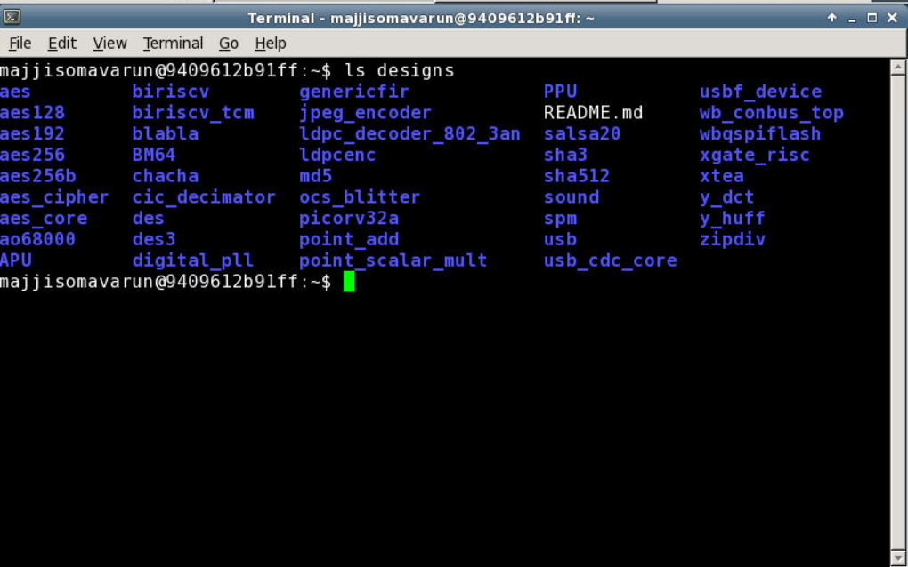

# Advanced OpenLANE Workshop

## Workshop Introduction
This was a 5-day workshop which was extensively conducted using opensource EDA tools(Openlane) by VSDOpen .

### Workshop Timeline

## DAY-1

**Design directory**

  Design directory stores all the design files\
  The input files which u want to pass into openlane has to be stored in thos directory\

 
 
 

**Openlane flow entry**

1.Go to openlane flow directory\
 Desktop/work/tools/openlane_working_directory/openlane_flow\
2.Type\
./flow.tcl -interactive\
3.Now you will enter to open lane flow and type\
package require openlane 0.9

4.Pass your design into openflow\
prep -design picorv32a \
-design ->pass the design folder name where you stored your input files to openlane\

Now openlane basically merges the lef file and technology file and forms a merged file called merged.lef\

5.We are passing picorv32a design into openlane.We can find picorv32a folder in design directory.\
There the verilog input files are stored in src folder.\
Config.tcl is used to set all variables with desired values for openlane flow.\
runs directory stores all the  run instances with a tag name is specified run by the user on openlane for design.By default run instance name is particular time and date of run.\

Config.tcl has parameters like clock_period,target_density which can be set to desired values

6.Type \
run_synthesis \
you will be able to see netlist formed by yosis and abc maps that netlist to skywater pdk cells.\
A yosis reprt will be generated which contains all information of cells used in syntheis file and STA report generated by OpenSta software at end of synthesis.

The new synthesis file will be stored in <designs/picorv32a/runs/"run_file_name"/results/synthesis>

